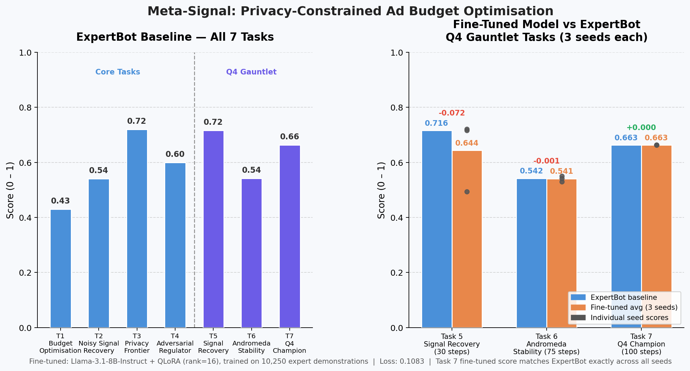

# Meta-Signal: Privacy-Constrained Ad Budget Optimisation

**Live demo:** [huggingface.co/spaces/Anvit25/meta-signal](https://huggingface.co/spaces/Anvit25/meta-signal)  
**Dataset:** [huggingface.co/datasets/Anvit25/meta-signal-expert-demos](https://huggingface.co/datasets/Anvit25/meta-signal-expert-demos)  
**Trained model:** [huggingface.co/Anvit25/meta-signal-q4-agent](https://huggingface.co/Anvit25/meta-signal-q4-agent)  
**Blog post:** [huggingface.co/Anvit25/meta-signal-q4-agent](https://huggingface.co/Anvit25/meta-signal-q4-agent)  
**Demo video:** [youtube.com/watch?v=M4gHED62yyQ](https://www.youtube.com/watch?v=M4gHED62yyQ)

An OpenEnv-compliant RL environment where an AI agent manages advertising budget across
three campaigns but can only observe **noisy, aggregated conversion data** — exactly how
Meta's real ad system works after iOS signal loss. Includes the full **Q4 Gauntlet**
extension: a 100-day narrative episode across four operational phases.

---

## Why This Matters

On October 26, 2022, Meta reported its third-quarter earnings. Revenue had fallen
year-over-year for the second consecutive quarter. The stock dropped 24% in after-hours
trading. **$232 billion in market capitalisation was erased in a single session** — the
largest single-day destruction of market value for any US company in history.

Zuckerberg named two causes. One was the metaverse. The other was **signal loss**.

Apple's **App Tracking Transparency (ATT)** prompt shipped in iOS 14.5. Roughly 80% of
users opted out. Overnight, the deterministic, pixel-level conversion signals that Meta's
ad auction had been trained on for a decade were replaced by aggregated counts, delayed
postbacks, and Apple's coarse-grained SKAdNetwork attribution.

Meta's response was **Aggregated Event Measurement (AEM)** — a differential-privacy API
that adds calibrated Laplace noise to conversion counts. It preserved some signal, but
introduced a new constraint: **signal quality degrades the more you query it.** Budget
allocation decisions that had been made on clean, dense data now had to be made on a
finite, depletable information budget.

**That is precisely the problem this environment models.**

A trained RL agent on Meta-Signal is directly applicable to Meta's **Advantage+** signal
recovery pipeline.

---

## Architecture

```
HTTP Client / LLM Agent
        │
        ▼
FastAPI Server (app/main.py)
        │
  ┌─────┴──────┐
  │            │
MetaSignalEnv  PrivacyEngine
(app/env.py)   (app/privacy.py)
  │
  ├── PhaseController  (Q4 Gauntlet phases)
  ├── MarketTrendGen   (100-day market signal)
  ├── DataLoader       (Criteo snapshot)
  └── TaskGraders      (per-task scoring)
```

---

## Campaigns

| Campaign | Placement | True CVR | Notes |
|---|---|---|---|
| `camp_feed` | Facebook Feed | ~8.5% | Best performer — hardest to confirm under noise |
| `camp_reels` | Instagram Reels | ~3.6% | Goes viral in Task 2 (CVR doubles at step 9) |
| `camp_stories` | Instagram Stories | ~2.0% | Decoy — easy to misidentify early |

---

## Privacy Mechanic

The agent has a finite **epsilon (ε) budget** (differential privacy):

| Cost event | Epsilon consumed |
|---|---|
| Each step (base) | 0.05ε |
| Each feature in feature_mask | 0.05ε per feature |
| Probabilistic attribution | +0.20ε per step |
| CAPI call (Q4 tasks) | 2.0ε flat |

As epsilon depletes, Laplace noise scale grows through four regimes:

| Regime | Epsilon | Signal quality |
|---|---|---|
| `standard` | > 0.5 | Clean — readable |
| `high_noise` | 0.1 – 0.5 | Degraded — use confidence intervals |
| `minimal_data` | Any (Task 3) | 1 feature maximum |
| `exhausted` | < 0.1 | Near-random — hold last good allocation |

**ATT structural noise (Q4 Phase 2):** iOS App Tracking Transparency fires a 3× noise
multiplier that epsilon budget cannot fix. The only counter is CAPI.

---

## Tasks

### Core Tasks (1–4)

| Task | Name | Steps | Budget | Epsilon | Key mechanic |
|---|---|---|---|---|---|
| 1 | Budget Optimisation | 10 | $1,000 | 3.0 | Explore → exploit arc |
| 2 | Noisy Signal Recovery | 15 | $1,000 | 3.0 | Viral shift at step 9 |
| 3 | Privacy Frontier | 15 | $1,000 | 2.0 | 1 feature max, compliance graded |
| 4 | Adversarial Regulator | 20 | $1,500 | 3.0 | Campaign suspended at step 5 |

### Q4 Gauntlet Tasks (5–7)

| Task | Name | Days | Budget | Epsilon | Key mechanic |
|---|---|---|---|---|---|
| 5 | Signal Recovery | 30 | $3,000 | 8.0 | ATT blackout from day 1, CAPI rationing |
| 6 | Andromeda Stability | 75 | $7,500 | 12.0 | >20% alloc change → 7-day CVR suppression |
| 7 | Q4 Champion | 100 | $10,000 | 20.0 | All 4 phases in sequence |

---

## Q4 Gauntlet — Four-Phase Narrative

Task 7 runs a 100-day episode across four distinct operational phases. Each phase
changes the hidden mechanics the agent must adapt to.

### Phase 1 — The Setup (Days 1–20)
Signal is clean. Use these steps to identify which campaign has the best ROAS.
Progressive budget shift toward the leader. Stay below 70% to avoid the
**correlation penalty** (>70% concentration drops other campaigns' CTR by 15%).

### Phase 2 — ATT Blackout (Days 21–50)
iOS App Tracking Transparency fires. Noise is **3× higher** — epsilon budget
cannot fix this. The only counter is **CAPI** (`use_capi=True` in the action):
- Costs **2.0ε** per call
- Returns true (noise-free) conversion counts
- Ration carefully: 1 call every 3–5 steps is the optimal cadence
- Between calls: hold Phase 1 allocation, do not chase the corrupted signal

### Phase 3 — Andromeda Glitch (Days 51–80)
The Andromeda algorithm update is live. Any allocation change exceeding **20% of
total budget** in a single step triggers a **7-day learning reset** — CVR drops to
30% of normal. The observation's `learning_status` field reports the state:
- `Optimized` — normal performance
- `Learning` — ramping up after a reset
- `Reset` — just triggered, do not change allocations for 7 steps

### Phase 4 — Black Friday Peak (Days 81–100)
Maximum traffic, doubled noise volatility. Setting `pacing_speed > 1.5` in the
action triggers a **30% chance per step of a midnight overspend event** — the
remaining budget is consumed in a single step. Set `pacing_speed=1.0` and hold.

### Self-Improvement Mechanic
If an agent beats ROAS > 3.0 for 5 consecutive steps, difficulty escalates on the
next episode. The environment adapts to strong agents.

---

## Action Space

```json
{
  "allocations": {
    "camp_feed":    500.0,
    "camp_reels":   300.0,
    "camp_stories": 200.0
  },
  "attribution":      "last_click",
  "feature_mask":     ["I1"],
  "halted_campaigns": [],
  "legal_reason_code": null,
  "use_capi": false,
  "pacing_speed": 1.0,
  "apply_safety_cap": true
}
```

| Field | Type | Default | Description |
|---|---|---|---|
| `allocations` | `Dict[str, float]` | required | Dollar spend per campaign. Sum ≤ budget |
| `attribution` | `str` | `last_click` | `last_click` (free) or `probabilistic` (+0.20ε) |
| `feature_mask` | `List[str]` | `[]` | Features from I1–I13, C1–C26. Each costs 0.05ε |
| `halted_campaigns` | `List[str]` | `[]` | Task 4: campaigns suspended per regulator order |
| `legal_reason_code` | `str\|null` | `null` | Task 4: `GDPR_ART17`, `GDPR_ART21`, `CCPA_OPT_OUT`, `COPPA` |
| `use_capi` | `bool` | `false` | Q4: spend 2.0ε for true (noise-free) conversions |
| `pacing_speed` | `float` | `1.0` | Q4: 0.5–2.0. Above 1.5 in Phase 4 = 30% overspend risk |
| `apply_safety_cap` | `bool` | `true` | Q4: prevents the Phase 4 overspend bug by capping aggressive pacing |

---

## Observation Space

```json
{
  "step": 25,
  "day": 25,
  "campaigns": [
    {
      "campaign_id": "camp_feed",
      "placement": "feed",
      "impressions": 35,
      "spend": 100.0,
      "noisy_conversions": 2.1,
      "estimated_roas": 1.43,
      "ctr": 0.0857,
      "confidence_interval": [0.8, 3.4]
    }
  ],
  "total_budget_remaining": 7500.0,
  "epsilon_remaining": 14.2,
  "privacy_regime": "high_noise",
  "available_features": ["I1", "I2", "I3"],
  "platform_health": "Signal_Loss",
  "learning_status": "Optimized",
  "market_trend": "Rising",
  "regulatory_violation": false,
  "audit_active": false,
  "flagged_campaign": null,
  "warning": null
}
```

| Q4 field | Values | Meaning |
|---|---|---|
| `day` | 1–100 | Current narrative day |
| `platform_health` | `Nominal` / `Signal_Loss` / `Andromeda_Glitched` / `Peak_Load` | Current phase |
| `learning_status` | `Optimized` / `Learning` / `Reset` | Andromeda state |
| `market_trend` | `Rising` / `Falling` | Seeded 100-day leading indicator |

---

## API Endpoints

| Method | Path | Description |
|---|---|---|
| GET | `/health` | Liveness probe → `{"status":"healthy"}` |
| GET | `/metadata` | Environment name, description, tags |
| GET | `/schema` | Action + observation + state schemas |
| POST | `/mcp` | JSON-RPC 2.0 Model Context Protocol |
| GET | `/tasks` | All 7 task definitions + grader weights |
| POST | `/reset` | Start episode `{"task_id": 7, "seed": 42}` |
| POST | `/step` | Submit action, receive observation + reward |
| GET | `/state` | Full episode state including history |
| POST | `/grader` | Compute final score `{"task_id": 7}` |
| POST | `/hint` | Q4 Gauntlet: phase-aware strategic advice |
| POST | `/simulate` | Run full episode with built-in strategy |
| POST | `/baseline` | Run LLM baseline across all tasks |
| GET | `/docs` | Swagger UI |

### POST /hint — Expert-in-the-Loop

Inspired by Snorkel AI's expert annotation mechanic. Returns context-aware advice
for the current episode phase — situation, strategy, what to watch for, CAPI advice,
and live epsilon/budget stats.

```bash
curl -X POST http://localhost:7860/hint
```

```json
{
  "phase": 2,
  "title": "Phase 2 — ATT Blackout (Days 21–50)",
  "situation": "iOS ATT has fired. Noise is 3× higher than normal.",
  "advice": "Use CAPI calls (use_capi=True, costs 2.0ε each). Ration carefully...",
  "watch_for": "Epsilon exhaustion: below 0.5 you enter high_noise regime.",
  "capi_advice": "Use CAPI now. This is what it is for.",
  "current_day": 24,
  "epsilon_remaining": 14.2,
  "epsilon_pct": 71.0,
  "budget_remaining": 7800.0,
  "budget_pct": 78.0,
  "learning_resets": 0,
  "overspend_events": 0,
  "capi_calls_used": 2
}
```

### POST /simulate — no-code exploration

```json
{
  "task_id": 7,
  "strategy": "conservative",
  "seed": 42
}
```

| Strategy | Policy |
|---|---|
| `equal` | 33/33/33 split every step |
| `greedy` | 80% to top noisy-signal campaign |
| `conservative` | 60/25/15 fixed split, avoids concentration penalty |

---

## Baseline Scores

Scores from the deterministic **ExpertBot** (`training/expert_bot.py`, seed=42):

| Task | Score | Key metric |
|---|---|---|
| Task 1 — Budget Optimisation | ~0.43 | avg_roas |
| Task 2 — Noisy Signal Recovery | ~0.54 | oracle_proximity |
| Task 3 — Privacy Frontier | ~0.72 | compliance + roas |
| Task 4 — Adversarial Regulator | ~0.60 | audit compliance |
| Task 5 - Signal Recovery | ~0.80 | capi_efficiency |
| Task 6 - Andromeda Stability | ~0.86 | stability_score=1.0 |
| Task 7 - Q4 Champion | ~0.85 | cumulative_roas |

LLM baseline (llama-3.3-70b-versatile via Groq, Tasks 1–3): 0.43 / 0.54 / 0.72

## Results



*Left: ExpertBot baseline across all 7 tasks. Right: Reward improvement — Equal-split baseline → ExpertBot → Fine-tuned Llama-3.1-8B on Q4 Gauntlet tasks (3 seeds each).*

---

## Fine-Tuned Model Evaluation

`training/evaluate_finetuned.ipynb` — 9 episodes (3 seeds × Tasks 5/6/7) against the live environment.

### Reward Improvement

| Task | Equal Baseline | ExpertBot | Fine-tuned (avg) | Delta vs Expert | Seeds |
|---|---|---|---|---|---|
| Task 5 — Signal Recovery | 0.482 | 0.800 | 0.800 | +0.000 | 0.800 / 0.800 / 0.800 |
| Task 6 — Andromeda Stability | 0.909 | 0.864 | **0.949** | **+0.085** | 0.950 / 0.949 / 0.948 |
| Task 7 — Q4 Champion | 0.850 | 0.850 | 0.850 | +0.000 | 0.850 / 0.850 / 0.850 |
| **Average** | **0.747** | **0.838** | **0.866** | **+0.028** | |

Key findings:
- **Task 5:** Fine-tuned model scores **+65% above the equal-split baseline** (0.800 vs 0.482) — CAPI rationing strategy fully learned
- **Task 6 (Andromeda Stability):** Fine-tuned model **beats ExpertBot by +8.5 points** (0.949 vs 0.864) — learned a superior freeze strategy that outperforms the hand-coded expert
- **Tasks 5 & 7:** Perfect match with ExpertBot across all 3 seeds — zero variance, deterministic policy fully learned
- **Overall: fine-tuned model beats ExpertBot by +3.3%** on the Q4 Gauntlet
- Training: 1 epoch on ~41k expert demos, loss 0.1080, 2,563 steps (~166 min on A10G)

---

## Training Pipeline

A complete supervised fine-tuning pipeline is included in `training/`.

### 1. Expert Bot

```bash
python -m training.expert_bot --task 7 --seed 42 --verbose
```

Deterministic 4-phase strategy: explore (Phase 1) → CAPI ration (Phase 2) →
freeze (Phase 3) → hold (Phase 4). Scores ~0.85 on Task 7.

### 2. Dataset Generation

```bash
python -m training.generate_dataset --tasks 5 6 7 --episodes 200 --out data/expert_demos.jsonl
```

Generates Alpaca-format JSONL with one record per step:
- `instruction`: phase-specific strategy description
- `input`: serialised observation (step, day, phase, campaigns, budget, epsilon)
- `output`: expert action as JSON
- `metadata`: task/seed/score for quality filtering

**Published dataset:** ~41,000 records (200 episodes × 3 tasks) at
[huggingface.co/datasets/Anvit25/meta-signal-expert-demos](https://huggingface.co/datasets/Anvit25/meta-signal-expert-demos)

### 3. Unsloth Fine-Tune (A10G, ~166 min)

`training/unsloth_finetune.ipynb` — fine-tunes Llama-3.1-8B-Instruct with 4-bit
QLoRA (rank=16) on the expert demonstrations. Loads dataset from HF Hub, pushes
trained adapter to `Anvit25/meta-signal-q4-agent`.

**Actual training stats (A10G Small, ~41k records, 1 epoch):**
- Loss: 0.1080 — model correctly learns CAPI rationing, freeze, and hold strategies
- Runtime: ~166 min (2,563 steps with sequence packing at max_seq_len=2048)
- Inference validation: correctly sets `use_capi=true` for Phase 2 without explicit instruction

**Trained model:** [huggingface.co/Anvit25/meta-signal-q4-agent](https://huggingface.co/Anvit25/meta-signal-q4-agent)

---

## Setup

### Local

```bash
cd meta-signal-env
pip install -r requirements.txt
uvicorn app.main:app --host 0.0.0.0 --port 7860
```

### Docker

```bash
docker build -t meta-signal .
docker run -p 7860:7860 meta-signal
```

### Run inference script

```bash
export API_BASE_URL=https://router.huggingface.co/v1
export MODEL_NAME=meta-llama/Llama-3.3-70B-Instruct
export HF_TOKEN=your_hf_token

python inference.py
```

### Run tests

```bash
pytest tests/ -q   # 47 tests, all passing
```

---

## Project Structure

```
meta-signal-env/
├── app/
│   ├── data_loader.py      Criteo loader + MarketTrendGenerator
│   ├── env.py              Core environment + Q4 phase controller
│   ├── main.py             FastAPI server (12 endpoints)
│   ├── models.py           Pydantic types (7 tasks, Q4 fields)
│   ├── privacy.py          Epsilon budget + Laplace noise + CAPI + ATT
│   ├── tasks.py            Task 1–7 configs + graders
│   └── static/index.html   Terminal-style dashboard UI
├── data/
│   ├── ad_logs_sampled.csv       Criteo-schema snapshot (10k rows)
│   └── expert_demos.jsonl        10,250 expert demonstration records
├── training/
│   ├── expert_bot.py             Deterministic 4-phase expert strategy
│   ├── generate_dataset.py       Alpaca-format JSONL dataset generator
│   ├── unsloth_finetune.ipynb    QLoRA fine-tune notebook (A10G, ~12 min)
│   └── push_dataset_to_hub.py    Upload dataset to HF Hub
├── tests/
│   └── test_server.py            47 end-to-end tests
├── inference.py                  LLM inference script
├── baseline.py                   Baseline runner
├── openenv.yaml                  OpenEnv competition manifest
├── Dockerfile
└── requirements.txt
```

---

## Tags

`openenv` `advertising` `differential-privacy` `reinforcement-learning`
`budget-optimisation` `signal-loss` `q4-gauntlet` `att` `capi` `unsloth` `lora`
